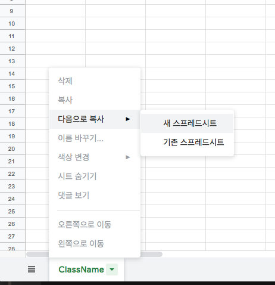
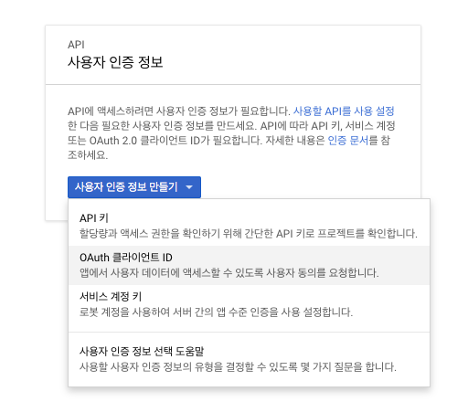
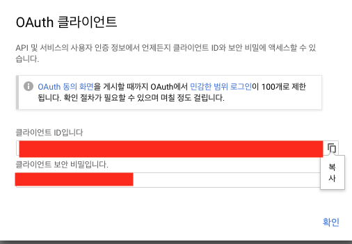
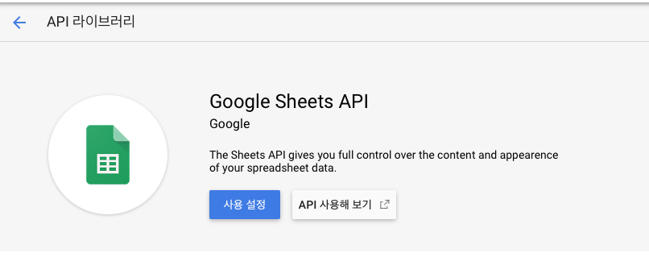
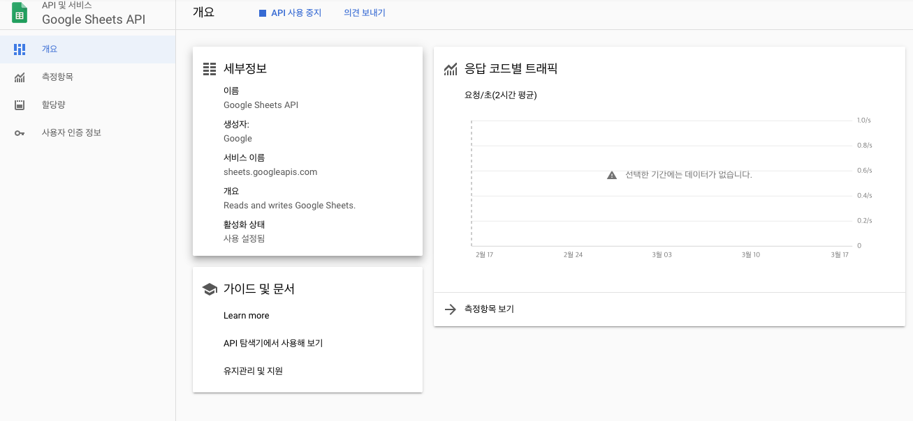
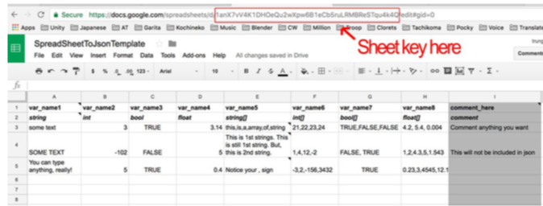
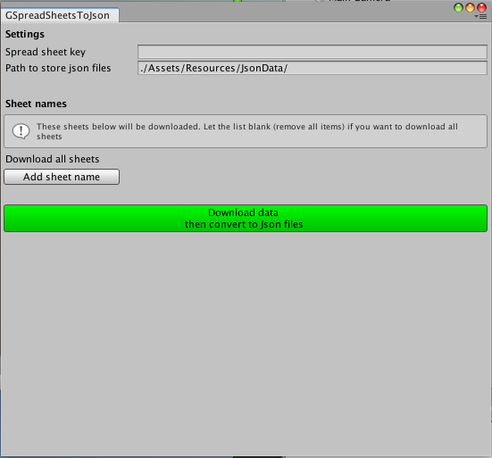

# google spread sheet example

- [Google sheet to Json](https://assetstore.unity.com/packages/tools/utilities/google-sheet-to-json-90369)
- 라이센스 Apache License 2.0

## 초기 세팅 방법

### 템플릿 가져오기
- [템플릿 링크](https://docs.google.com/spreadsheets/d/1syVgzYdg5YfqwnOfl8l7iLSlTA3-75NdCklQVPcHWw0/edit#gid=0)
- 위 템플릿을 자신의 프로젝트에 가져오기 위한 새 스프레드 시트로 복사

### OAuth2[^1] 인증

- Client Id, Client Secret key등을 입력 해야 된다.
- https://console.developers.google.com/?pli=1
- 유형은 기타를 선택 하였습니다.

### API 사용 설정

### Spread Key 확인
- Sheet key는 구글 시트 url 안에 있습니다. “spreadsheets/d/”와 “/edit” 사이에 있습니다.

### Client Id, Client Secret key, Spread Key 입력
- GSpreadSheetsToJson.cs 파일에 선언된 CLIENT_ID, CLIENT_SECRET에 자신의 키를 입력
- Utility - GSpreadSheetsToJson 윈도우 창을 열면 Spread sheet key 입력란이 있고 여기에 자신에 시트에 해당되는 시크릿 키를 입력합니다.

[^1]: OAuth는 인터넷 사용자들이 비밀번호를 제공하지 않고 다른 웹사이트 상의 자신들의 정보에 대해 웹사이트나 애플리케이션의 접근 권한을 부여할 수 있는 공통적인 수단으로서 사용되는, 접근 위임을 위한 개방형 표준이다